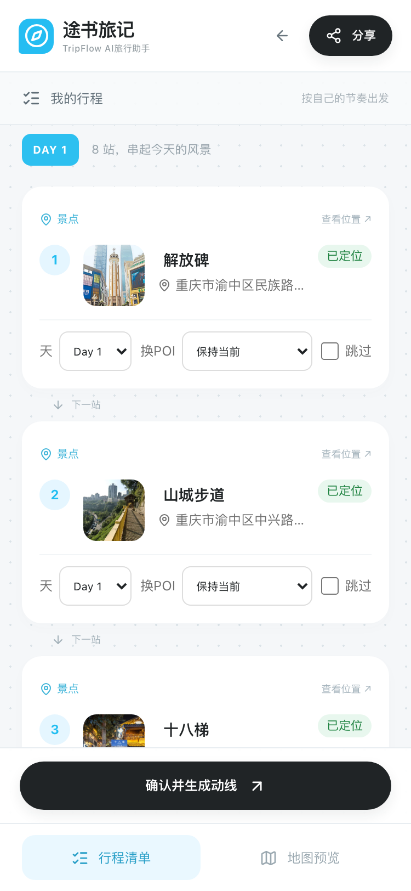

# 途书旅记 · TripFlow AI 旅行助手

> 粘贴一篇小红书攻略 → 自动识别地点、按天整理 → 生成百度地图多途经点动线，支持导航、分享与长图导出。
> 比赛 demo：重庆特种兵 2 日游。

- 产品代码与启动说明：[旅行助手/README.md](旅行助手/README.md)
- 开发文档目录：[旅行助手/开发文档/0-目录.md](旅行助手/开发文档/0-目录.md)
- 项目状态：[旅行助手/开发文档/项目状态.md](旅行助手/开发文档/项目状态.md)
- 朋友接手：[旅行助手/协作/接手说明.md](旅行助手/协作/接手说明.md)

技术栈：后端 Python + FastAPI + SQLite；前端 Vite + React + TypeScript；地图用百度地图 Web 服务 API + JSAPI GL；地点抽取用 DeepSeek。单端口运行（前端构建产物由后端同源提供）。

---

## 最近更新（2026-09-30）

本轮四处改动，截图均来自本机真实运行、真实行程数据（酒店与图片为真实接口返回，未使用 mock）。完整说明见 [本次更新说明](旅行助手/开发文档/证据包/本次更新-2026-09-30/更新说明.md)。

### 1. 首页「试试这篇重庆攻略」只填入输入框，不再自动解析


- 点击输入框右下角「试试这篇重庆攻略 ↗」后，示例链接 `https://xhslink.cn/o/10vTPLjLXy7` 出现在输入框中，光标停在输入框。
- 右侧发送按钮由灰变黑（可点击）；页面**不跳转、不开始解析**，由用户自己点黑色箭头再开始。
- 行程页左侧栏的同名按钮行为相同。

### 2. 地点确认卡片：名称前加方形实景小图

桌面（1280 宽）：


手机（375 宽）：



- 每张卡片从左到右：**序号 → 56×56 方形实景小图 → 地点名 + 地址 → 「已定位」**；下方「天 / 换POI / 跳过」操作行不变。
- 图中可见 1 解放碑（纪功碑与商圈）、2 山城步道（崖壁栈道）、3 十八梯。
- 悬停显示「图片来源：百度百科 · 词条名」，点击打开对应百科词条。手机上地址过长以「…」截断，不撑破卡片。
- **图片来源**：百度百科词条首图，后端下载缩略图缓存到本机再提供（百科图床禁止外站直接引用）。
- **防错图**：自动排除同名作品（「十八梯」先匹配到小说、「李子坝」匹配到歌曲）、外地同名地点（成都也有「江滩公园」）、标志 / 站牌类白底图。
- 示例行程 16 个地点命中 12 个，逐张人工核对均为对应实景；其余 4 个（江滩公园、鹅岭二厂、李子坝、北仓文创园）没有可靠图片就不显示，不拿无关图片凑数。

### 3. 动线结果：每天卡片结尾「今晚住哪」，三档酒店推荐

Day 1 结尾（桌面）：


- 位置：当天最后一站之后、「在百度地图开始导航」按钮下方。
- 以**当天最后一站**为中心推荐（「在「江滩公园」收尾，住附近不折返」），经济 / 舒适 / 高端各一家：

| 档位 | 酒店 | 评分 / 评价数 | 距江滩公园 |
| --- | --- | --- | --- |
| 经济实惠（经济型） | 如家酒店(重庆解放碑洪崖洞店) | 4.7 / 51 条 | 690 米 |
| 舒适品质（舒适型） | 全季酒店(重庆解放碑洪崖洞店) | 4.7 / 60 条 | 881 米 |
| 高端享受（豪华型） | 重庆来福士洲际酒店 | 4.8 / 90 条 | 1.1 公里 |

Day 2 结尾（手机）：


- Day 2 以最后一站「塔坪」为中心，推荐与 Day 1 不同：

| 档位 | 酒店 | 评分 / 评价数 | 距塔坪 |
| --- | --- | --- | --- |
| 经济实惠（经济型） | 汉庭酒店(重庆观音桥地铁站店) | 4.7 / 191 条 | 532 米 |
| 舒适品质（舒适型） | 美宿天晴高空全景酒店(观音桥店) | 4.9 / 37 条 | 400 米 |
| 高端享受（高档型） | 罗博先生酒店(重庆观音桥店) | 5.0 / 17 条 | 457 米 |

- 「查看位置」：电脑打开百度地图网页版定位，手机尝试唤起百度地图 App；手机上为整行大按钮。
- **选取规则**：百度地点检索最后一站 3 公里内的酒店（某档缺货时放宽到 8 公里）；按百度档次标签分档（经济型 / 舒适型 / 高档型·豪华型·星级）；每档取评分最高者，优先评价数 ≥10 的。
- **不显示价格**：百度接口基本不返回价格，页面注明「价格和房态以预订平台为准」，不编造价格。
- 每个行程只查询一次并缓存，地点变化后才重新查询。

### 4. 结果页版式

按天白色卡片、紧凑地图、逐站时间线、底部「留住这份旅行灵感」（分享 / 保存长图）沿用参考图，本轮未改动。

### 验证

| 检查项 | 结果 |
| --- | --- |
| 后端测试 `pytest tests/ -q` | 42 / 42 通过（新增酒店 4 条、实景图 4 条） |
| 前端测试 `npm run test` | 3 / 3 通过 |
| 前端构建（含 TypeScript 检查） | 通过 |
| 桌面 1280 / 手机 375 | 已截图检查，无横向溢出 |
| 密钥 | `.env`、`frontend/.env.local`、`data/`、`dist/` 均不入库；提交前已扫描确认无密钥 |

### 新增接口

| 接口 | 说明 |
| --- | --- |
| `GET /api/v1/trips/{id}/hotels` | 按天返回最后一站附近三档酒店 |
| `GET /api/v1/trips/{id}/photos` | 返回各地点实景图（只含找到可靠图片的地点） |
| `GET /api/v1/trips/{id}/photos/{地点ID}.jpg` | 本机缓存的缩略图 |

### 已知限制

- 实景图版权归百度百科及原作者，页面已标注来源；本机演示可用，公开上线前需再评估授权。
- Day 2 为最后一天，多数人当天返程；目前照常推荐酒店，后续可改为隐藏或提示「如需多住一晚」。
- 分享只读、运行中刷新恢复、生成后重新编辑等衔接问题，以及 ESLint 配置，仍是既有未了项（见项目状态）。

---

## 快速启动

```bash
cd 旅行助手/frontend && npm ci && npm run build
cd ../backend && python3 -m venv .venv && ./.venv/bin/pip install -r requirements.txt
./.venv/bin/playwright install chromium   # 长图导出用
./.venv/bin/python -m uvicorn app.main:app --host 0.0.0.0 --port 8000
```

浏览器打开 http://127.0.0.1:8000/ 。密钥配置（百度地图 AK、DeepSeek Key）见 [旅行助手/README.md](旅行助手/README.md)，复制 `.env.example` 为 `.env` 后自行填写，切勿提交。
